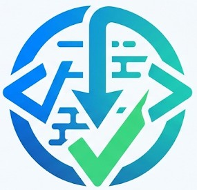
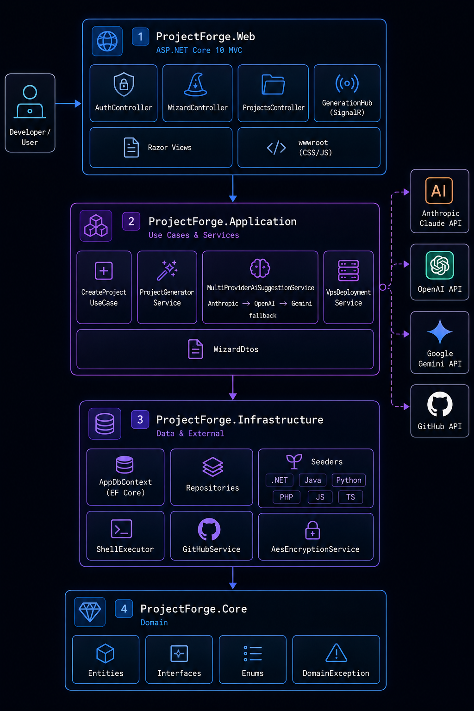
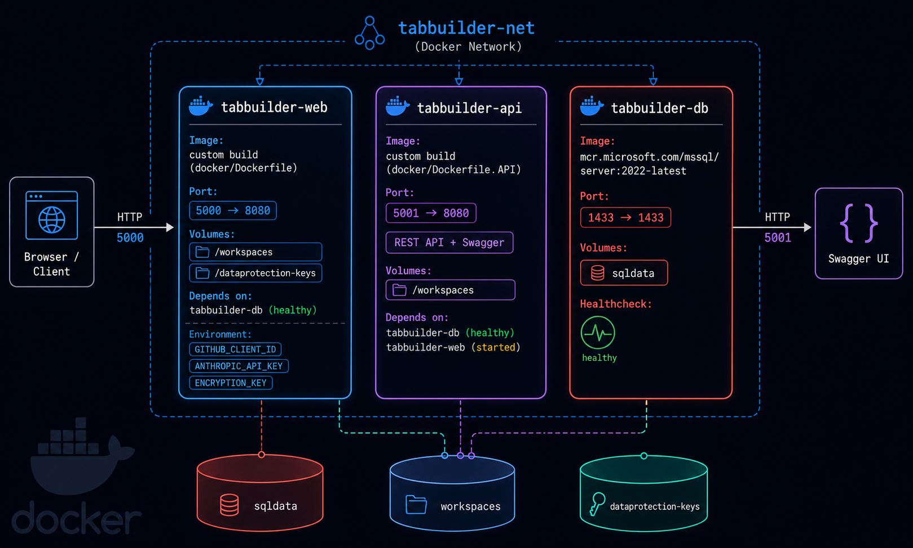

<div align="center">
  

# TabBuilder

> **SaaS platform to generate complete software projects with AI**
> Pick your stack, get intelligent pattern and library suggestions, generate the full codebase, create the GitHub repository and deploy to your VPS — all from a browser wizard.

</div>

[](https://dotnet.microsoft.com)
[](https://www.microsoft.com/sql-server)
[](https://www.docker.com)
[](https://dotnet.microsoft.com/apps/aspnet/signalr)
[](LICENSE)

---

## 📋 Table of contents

- [What is TabBuilder?](#-what-is-tabbuilder)
- [Features](#-features)
- [Supported languages & frameworks](#-supported-languages--frameworks)
- [System architecture](#-system-architecture)
- [Project structure](#-project-structure)
- [Quick start](#-quick-start)
- [Environment variables](#-environment-variables)
- [Routes & endpoints](#-routes--endpoints)
- [REST API](#-rest-api)
- [AI integration](#-ai-integration-multi-provider)
- [Real-time with SignalR](#-real-time-with-signalr)
- [Database](#-database)
- [Security](#-security)
- [CI/CD & Docker](#-cicd--docker)
- [Tests](#-tests)
- [Contributing](#-contributing)
- [License](#-license)

---

## 🚀 What is TabBuilder?

TabBuilder is a SaaS platform built with **ASP.NET Core 10 MVC** that automates software project scaffolding. Through a 5-step wizard, the user selects their language, framework, database, infrastructure and design patterns. The AI (Claude, with fallback to OpenAI and Gemini) suggests patterns and libraries suited to the chosen stack. The system then runs the native scaffolding commands (`dotnet new`, `composer create-project`, Spring Initializr, etc.), generates infrastructure files (Docker Compose, Kubernetes, GitHub Actions), creates the GitHub repository, makes the initial commit and can deploy via SSH to one or multiple VPS servers.

---

## ✨ Features

| Feature | Description |
|---|---|
| 🧙 **Step-by-step wizard** | 5 guided steps: architecture → framework → database → infrastructure → patterns |
| 🤖 **Multi-provider AI** | Suggestions via Claude (Anthropic) → OpenAI → Gemini (automatic fallback with DB cache) |
| ⚡ **Native scaffolding** | Runs `dotnet new`, `npm init`, `composer`, Spring Initializr, `django-admin`, etc. |
| 🐳 **Docker & Kubernetes** | Generates `docker-compose.yml`, `Dockerfile` and complete K8s manifests |
| 📤 **Push to GitHub** | OAuth authentication, automatic repo creation, initial commit and push |
| 🖥️ **Deploy to VPS** | SSH to one or multiple servers with AES-256-encrypted credentials |
| 📄 **AI-generated README** | The AI writes full documentation tailored to the chosen stack |
| 🔄 **GitHub Actions CI/CD** | Ready-to-use pipeline with build, test and Docker image push to GHCR |
| 📡 **Real-time logs** | Live generation logs via SignalR (`/hubs/generation`) |
| 🔒 **Security** | HttpOnly cookies, AES-256 encryption, 30-day sessions |

---

## 🌐 Supported languages & frameworks

| Language | Available frameworks | Seeder | Design patterns |
|---|---|---|---|
| **C# / .NET** | ASP.NET Core Web API, MVC, Blazor Server, Blazor WASM, Minimal API | `DotNetSeeder` | Repository, CQRS, Clean Architecture, DDD, Hexagonal |
| **Java** | Spring Boot 3.x, Quarkus, Micronaut | `JavaSeeder` | Repository, CQRS, Clean Architecture, DDD, Hexagonal |
| **Python** | FastAPI, Django 5, Flask 3 | `PythonSeeder` | Repository, CQRS, Clean Architecture |
| **PHP** | Laravel 11, Symfony | `PhpSeeder` (4 modular files) | DDD, Clean Arch, Hexagonal, Repository, CQRS, Event Sourcing, Mediator, Saga, Microservices |
| **JavaScript** | Node.js, Express.js, NestJS, Next.js | `JavaScriptSeeder` | Repository, Clean Arch, Hexagonal, CQRS, Event Sourcing, Mediator, Microservices |
| **TypeScript** | NestJS (TS), Next.js (TS) | `JavaScriptSeeder` | CQRS (NestJS), Repository, Clean Architecture |

### Supported databases

`PostgreSQL` · `MySQL` · `SQL Server` · `MongoDB` · `Redis` · `SQLite`

### Infrastructure

- **Docker Compose** — production-ready `docker-compose.yml` + `Dockerfile`
- **Kubernetes** — `k8s/deployment.yaml`, `k8s/service.yaml`, `k8s/configmap.yaml`
- **GitHub Actions** — pipeline with build, test and image push to GHCR

---

## 🏛️ System architecture

TabBuilder follows a **Clean Architecture** layered design:



```
┌─────────────────────────────────────────────────────┐
│                  TabBuilder.Web                     │
│  ASP.NET Core MVC · Razor Views · SignalR Hubs      │
│  Controllers: Auth / Wizard / Projects / Dashboard  │
└────────────────────────┬────────────────────────────┘
                         │
┌────────────────────────▼────────────────────────────┐
│              TabBuilder.Application                 │
│  Use Cases · AI Services · Generator Service        │
│  DTOs · VPS Deployment Service                      │
└────────────────────────┬────────────────────────────┘
                         │
┌────────────────────────▼────────────────────────────┐
│              TabBuilder.Infrastructure              │
│  EF Core · Repositories · Seeders · Migrations      │
│  GitHub Service · Shell Executor · AES Encryption   │
└────────────────────────┬────────────────────────────┘
                         │
┌────────────────────────▼────────────────────────────┐
│                 TabBuilder.Core                     │
│  Entities · Interfaces · Enums · Domain Exceptions  │
└─────────────────────────────────────────────────────┘
```

---

## 📁 Project structure

```
TabBuilder/
├── src/
│   ├── TabBuilder.Core/                        # Domain core
│   │   ├── Entities/Entities.cs                # User, Project, WizardConfig, Template…
│   │   ├── Interfaces/IInterfaces.cs           # IProjectRepo, IGitHub, IAI, IEncryption…
│   │   ├── Enums/Enums.cs                      # ArchitectureType, DatabaseType, FrameworkType…
│   │   └── Exceptions/DomainException.cs
│   │
│   ├── TabBuilder.Application/                 # Use cases & services
│   │   ├── AI/
│   │   │   ├── AnthropicAiSuggestionService.cs     # Direct Claude API calls
│   │   │   └── MultiProviderAiSuggestionService.cs # Fallback chain + DB cache
│   │   ├── Services/
│   │   │   ├── ProjectGeneratorService.cs           # Main orchestrator
│   │   │   ├── ProjectGeneratorService.Scaffolding.cs
│   │   │   ├── ProjectGeneratorService.BaseFiles.cs
│   │   │   ├── ProjectGeneratorService.Patterns.DotNet.cs
│   │   │   ├── ProjectGeneratorService.Patterns.Java.cs
│   │   │   ├── ProjectGeneratorService.Patterns.Laravel.cs
│   │   │   ├── ProjectGeneratorService.Patterns.Php.cs
│   │   │   ├── ProjectGeneratorService.Patterns.Symfony.cs
│   │   │   ├── ProjectGeneratorService.PostProcess.cs
│   │   │   └── VpsDeploymentService.cs
│   │   ├── UseCases/Projects/CreateProjectUseCase.cs
│   │   └── DTOs/WizardDtos.cs
│   │
│   ├── TabBuilder.Infrastructure/              # Infrastructure implementations
│   │   ├── Data/AppDbContext.cs                # EF Core + seeder registration
│   │   ├── Repositories/Repositories.cs
│   │   ├── Migrations/                         # EF Core migration history
│   │   ├── Seeders/
│   │   │   ├── DotNet/DotNetSeeder.cs
│   │   │   ├── Java/JavaSeeder.cs
│   │   │   ├── JavaScript/JavaScriptSeeder.cs
│   │   │   ├── Php/PhpSeeder.cs + DesignPatternsSeeder.cs + LibrariesSeeder.cs + ProjectTemplatesSeeder.cs
│   │   │   ├── Python/PythonSeeder.cs
│   │   │   └── TypeScript/TypeScriptSeeder.cs
│   │   └── Infrastructure.cs                   # ShellExecutor · GitHubService · AesEncryptionService
│   │
│   ├── TabBuilder.Web/                         # Main MVC application
│   │   ├── Controllers/
│   │   │   ├── AuthController.cs               # GitHub OAuth
│   │   │   ├── WizardController.cs             # 5-step wizard + AI + generation
│   │   │   ├── ProjectsController.cs           # Project CRUD
│   │   │   └── HomeController.cs
│   │   ├── Hubs/GenerationHub.cs               # SignalR hub
│   │   ├── Views/                              # Razor views (Auth, Wizard, Dashboard, Projects)
│   │   ├── wwwroot/
│   │   │   ├── css/app.css
│   │   │   ├── js/wizard.js                    # Wizard logic + SignalR client
│   │   │   └── img/logos/                      # Framework, DB and infra logos
│   │   └── Program.cs
│   │
│   └── TabBuilder.API/                         # Standalone REST API with Swagger
│       ├── Controllers/TabBuilderController.cs
│       └── Program.cs
│
├── tests/
│   └── TabBuilder.Application.Tests/
│       ├── CreateProjectUseCaseTests.cs
│       └── ProjectDomainTests.cs
│
├── docker/
│   ├── Dockerfile                              # MVC web image
│   └── Dockerfile.API                          # REST API image
├── docker-compose.yml                          # Web + API + SQL Server
├── .github/workflows/ci.yml                    # Build → Test → Docker Push → Deploy
├── scripts/setup.sh                            # Interactive initial setup
├── .env.example
└── TabBuilder.sln
```

---

## 🚀 Quick start

### Prerequisites

- [.NET 10 SDK](https://dotnet.microsoft.com/download)
- [Docker + Docker Compose](https://docs.docker.com/get-docker/)
- Git
- GitHub account (to create the OAuth App)
- API Key from [Anthropic](https://console.anthropic.com/) (recommended), [OpenAI](https://platform.openai.com/) or [Google Gemini](https://aistudio.google.com/)

### 1. Clone the repository

```bash
git clone https://github.com/your-username/tabbuilder.git
cd tabbuilder
```

### 2. Run the setup script

```bash
chmod +x scripts/setup.sh && ./scripts/setup.sh
```

The script creates the `.env` file with default values, checks dependencies and applies pending migrations if a local database is detected.

### 3. Create the GitHub OAuth App

1. Go to [https://github.com/settings/applications/new](https://github.com/settings/applications/new)
2. **Application name**: `TabBuilder`
3. **Homepage URL**: `http://localhost:5000`
4. **Authorization callback URL**: `http://localhost:5000/auth/github/callback`
5. Copy the generated **Client ID** and **Client Secret**

### 4. Configure environment variables

```bash
cp .env.example .env
nano .env   # or your preferred editor
```

Fill in at least:

```env
GITHUB_CLIENT_ID=your_client_id
GITHUB_CLIENT_SECRET=your_client_secret
ANTHROPIC_API_KEY=sk-ant-...
ENCRYPTION_KEY=a_random_key_of_at_least_32_characters
```

### 5. Start the application



---

```bash
# With Docker Compose (recommended — starts Web + API + SQL Server)
docker-compose up --build

# Or in local development mode (requires SQL Server available)
cd src/TabBuilder.Web
dotnet run
```

The application will be available at:

| Service | URL |
|---|---|
| Web (MVC) | http://localhost:5000 |
| REST API (Swagger) | http://localhost:5001/swagger |
| SQL Server | localhost:1433 |

---

## 🔧 Environment variables

| Variable | Description | Required |
|---|---|---|
| `GITHUB_CLIENT_ID` | GitHub OAuth App Client ID | ✅ |
| `GITHUB_CLIENT_SECRET` | GitHub OAuth App Client Secret | ✅ |
| `ANTHROPIC_API_KEY` | Anthropic (Claude) API Key | ⚠️ Recommended |
| `OPENAI_API_KEY` | OpenAI API Key (fallback #1) | Optional |
| `GEMINI_API_KEY` | Google Gemini API Key (fallback #2) | Optional |
| `ENCRYPTION_KEY` | AES-256 key for encrypting VPS passwords (min. 32 chars) | ✅ |
| `DB_PASSWORD` | SQL Server password for Docker Compose | ✅ |

---

## 🗺️ Routes & endpoints

### Web (MVC)

| Method | Route | Description |
|---|---|---|
| `GET` | `/` | Landing page |
| `GET` | `/auth/login` | Login page |
| `GET` | `/auth/github` | Starts GitHub OAuth flow |
| `GET` | `/auth/github/callback` | GitHub OAuth callback |
| `POST` | `/auth/logout` | Sign out |
| `GET` | `/dashboard` | Authenticated user's project list |
| `POST` | `/projects` | Creates a project via `CreateProjectUseCase` |
| `GET` | `/projects/{id}` | Project detail |
| `GET` | `/projects/{id}/logs` | Generation logs as JSON |
| `POST` | `/projects/{id}/deploy` | Deploy project to VPS via SSH |
| `DELETE` | `/projects/{id}` | Delete a project |
| `GET` | `/wizard` | Wizard start (step 1) |
| `GET/POST` | `/wizard/step1` | Architecture selection |
| `GET/POST` | `/wizard/step2` | Framework selection |
| `GET/POST` | `/wizard/step3` | Database selection |
| `GET/POST` | `/wizard/step4` | Infrastructure selection |
| `GET/POST` | `/wizard/step5` | Design pattern selection |
| `GET` | `/wizard/generate/{id}` | Real-time generation view |
| `POST` | `/wizard/generate/{id}/start` | Start generation (async) |
| `POST` | `/wizard/api/suggest` | AI suggestions (JSON) |
| `GET` | `/wizard/api/frameworks/{arch}` | Framework options by architecture |

---

## 🔌 REST API

The standalone API (`TabBuilder.API`) exposes the same resources as pure REST with Swagger at `http://localhost:5001/swagger`.

Example request to generate a project:

```http
POST /api/v1/projects
Content-Type: application/json
Authorization: Bearer <token>

{
  "name": "my-api",
  "description": "REST API with FastAPI and PostgreSQL",
  "architecture": "Python",
  "framework": "FastAPI",
  "database": "PostgreSQL",
  "infrastructure": "DockerCompose",
  "designPatterns": ["Repository", "CQRS"],
  "isPrivate": false
}
```

---

## 🤖 AI integration (multi-provider)

The `MultiProviderAiSuggestionService` implements an **automatic fallback chain**:

```
Anthropic (Claude) → OpenAI (GPT-4o) → Google Gemini
```

If the primary provider fails or has no API key configured, it automatically moves to the next one. All responses are **cached in the database for 30 days** to minimize token consumption.

### AI use cases

**1. Wizard suggestions** (`POST /wizard/api/suggest`)

Receives the stack selected up to that point and returns recommended design patterns and libraries, using the database catalog as context.

```json
{
  "architecture": "Java",
  "framework": "SpringBoot",
  "database": "PostgreSQL",
  "infrastructure": "DockerCompose",
  "alreadySelectedPatterns": []
}
```

Response:
```json
{
  "suggestedPatterns": ["Repository", "CQRS", "CleanArchitecture"],
  "suggestedLibraries": ["Spring Data JPA", "MapStruct", "Lombok"],
  "rationale": "For a REST API with Spring Boot and PostgreSQL, the Repository pattern..."
}
```

**2. README generation** (automatic upon project completion)

The AI generates a complete `README.md` tailored to the stack, including installation commands, environment variables, directory structure and a CI/CD guide.

---

## 📡 Real-time with SignalR

The generation screen connects to the `/hubs/generation` hub and receives live events:

```javascript
const connection = new signalR.HubConnectionBuilder()
    .withUrl("/hubs/generation")
    .build();

// Log for each generation step
connection.on("ReceiveLog", (log) => {
    // log = { step, message, isError, timestamp }
    console.log(`[${log.step}] ${log.message}`);
});

// Project status change
connection.on("StatusChanged", (status) => {
    // "Generating" | "Published" | "Failed"
});

await connection.start();
await connection.invoke("JoinProject", projectId);
```

The server emits events through `IHubContext<GenerationHub>` from `ProjectGeneratorService` as each scaffolding command executes.

---

## 🗄️ Database

### Main tables

| Table | Description |
|---|---|
| `Users` | Users authenticated via GitHub OAuth |
| `Projects` | Generated projects (name, status, repo URL, local path) |
| `WizardConfigs` | Wizard configuration chosen per project |
| `ProjectLogs` | Line-by-line log of each generation step |
| `ProjectTemplates` | Templates: Dockerfile, docker-compose, k8s, ci, .gitignore |
| `LibraryRecommendations` | Library catalog by language and framework |
| `DesignPatternEntries` | Design pattern catalog by language |
| `VpsCredentials` | SSH credentials per project (AES-256 encrypted password) |
| `AiSuggestionCache` | AI response cache (30-day TTL) |

### Migrations

```bash
# Apply pending migrations
cd src/TabBuilder.Infrastructure
dotnet ef database update --startup-project ../TabBuilder.Web

# Create a new migration
dotnet ef migrations add MigrationName --startup-project ../TabBuilder.Web
```

### Adding new infrastructure templates

```csharp
// In a seeder or migration:
new ProjectTemplate
{
    Name = "Compose Python + MongoDB",
    TemplateType = "compose",
    Architecture = ArchitectureType.Python,
    Database = DatabaseType.MongoDB,
    Infrastructure = InfrastructureType.DockerCompose,
    Content = "..." // Content with {{PROJECT_NAME}}, {{DB_PASSWORD}}, etc.
}
```

---

## 🔒 Security

- **VPS passwords** are stored encrypted with **AES-256** (`AesEncryptionService`)
- **GitHub tokens** are stored in the encrypted cookie session (ASP.NET Core Data Protection API)
- Session cookies are `HttpOnly`, `SameSite=Lax` with a **30-day** expiry
- Data Protection keys are persisted in a dedicated Docker volume (`dataprotection-keys`)
- In production, it is recommended to store GitHub tokens encrypted with the same AES key or in an external vault (Azure Key Vault, HashiCorp Vault)

---

## 🐳 CI/CD & Docker

### Docker Compose

```bash
# Start all services (Web + API + SQL Server)
docker-compose up --build -d

# View logs
docker-compose logs -f web

# Stop and remove containers
docker-compose down
```

### GitHub Actions pipeline (`.github/workflows/ci.yml`)

The pipeline runs on every push to `main` or `develop` and on Pull Requests to `main`:

```
push / PR
    │
    ▼
[Build & Test] ── .NET 10 + SQL Server as service
    │               dotnet restore → build → test
    │               Uploads .trx results as artifact
    │
    ▼ (main only)
[Docker Build & Push] ── Buildx + GHA cache
    │                     Push to GHCR (ghcr.io/org/tabbuilder)
    │                     Tags: latest, sha-XXXX, semver
    │
    ▼ (main only, environment: production)
[Deploy VPS] ── SSH via appleboy/ssh-action
                docker-compose pull && up -d
```

Required GitHub secrets for deployment:

| Secret | Description |
|---|---|
| `DEPLOY_HOST` | Production server IP or domain |
| `DEPLOY_USER` | SSH user |
| `DEPLOY_SSH_KEY` | Private SSH key |

---

## 🧪 Tests

```bash
# Run all tests
dotnet test TabBuilder.sln

# With coverage
dotnet test --collect:"XPlat Code Coverage"

# Application tests only
dotnet test tests/TabBuilder.Application.Tests/
```

Current test coverage:

- `CreateProjectUseCaseTests` — validates the project creation flow
- `ProjectDomainTests` — domain rules for `Project` and `WizardConfig` entities

---

## 🤝 Contributing

```bash
# 1. Fork and clone
git checkout -b feature/new-architecture

# 2. Make changes with conventional commits
git commit -m "feat: add Go/Gin support"

# 3. Push and open a Pull Request
git push origin feature/new-architecture
```

### Adding support for a new stack

1. Add value to `ArchitectureType` and/or `FrameworkType` (`Core/Enums/Enums.cs`)
2. Create `NewSeeder.cs` in `Infrastructure/Seeders/NewLanguage/` with libraries and patterns
3. Register the seeder in `AppDbContext.OnModelCreating()`
4. Add case in `ProjectGeneratorService.GetScaffoldCommands()`
5. Create `ProjectGeneratorService.Patterns.NewLanguage.cs` with pattern templates
6. Update `WizardController.GetFrameworkOptions()` for the new stack
7. Add migration with `dotnet ef migrations add AddNewLanguageSeedData`
8. Add the framework logo to `wwwroot/img/logos/frameworks/`

### Commit conventions

```
feat:     new feature
fix:      bug fix
docs:     documentation only
refactor: code change with no functional impact
test:     add or fix tests
chore:    build, CI or dependency changes
```

---

## 📄 License

MIT — see [LICENSE](LICENSE)

---

<div align="center">
  Built with ❤️ on ASP.NET Core 10 · Claude AI · SignalR · Entity Framework Core · Docker
</div>